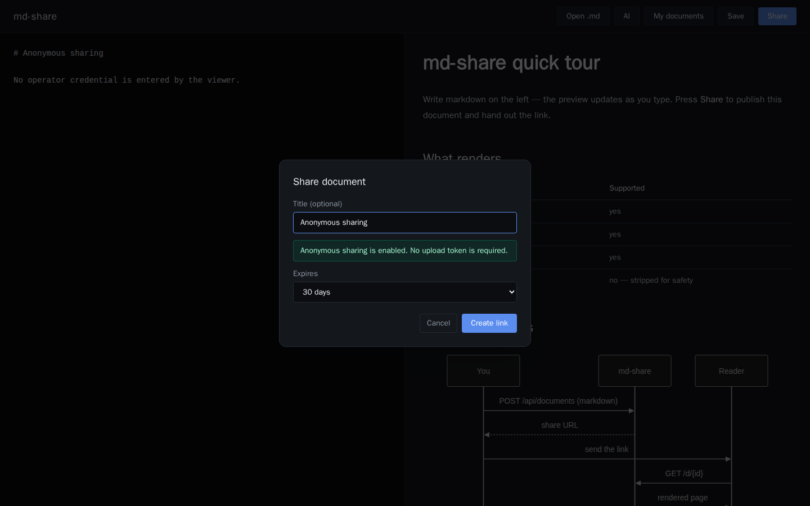
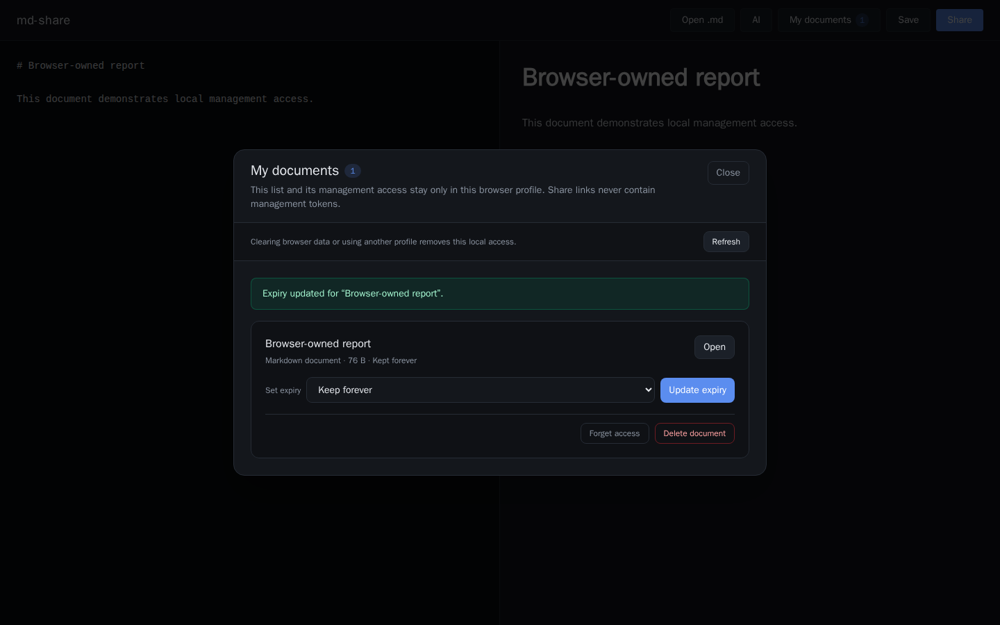

# md-share 웹 사용자 가이드

> 이 문서는 `docs/ui-scenarios`의 실행 가능한 브라우저 시나리오에서 생성한다.

## 업로드 token 없이 공유

익명 공유가 설정된 웹 편집기는 운영자 token을 사용자에게 요구하지 않고 문서별 관리 권한만 브라우저에 저장한다.

1. 편집기에서 Markdown을 작성하고 Share를 누른다.
2. 익명 공유 안내를 확인한다. Upload token 입력란은 표시되지 않는다.
3. 제목과 만료 기간을 선택하고 Create link를 누른다.
4. 생성된 공유 URL만 전달하고 문서 관리 권한은 현재 브라우저에 둔다.

## 이 브라우저에서 만든 문서 관리

웹에서 만든 공유 문서의 관리 권한은 공유 링크와 분리되어 현재 브라우저 프로필에만 저장된다.

1. 편집기에서 Markdown을 작성하고 Share를 눌러 링크를 만든다.
2. 공유 결과에서 관리 권한이 이 브라우저에 저장됐는지 확인한다.
3. Open My documents를 눌러 이 브라우저가 관리할 수 있는 문서를 연다.
4. 만료 기간을 변경하거나 Keep forever를 선택해 보관 기간을 갱신한다.
5. Forget access는 로컬 권한만 지우고, Delete document는 모든 접속자에게서 문서를 삭제한다.
